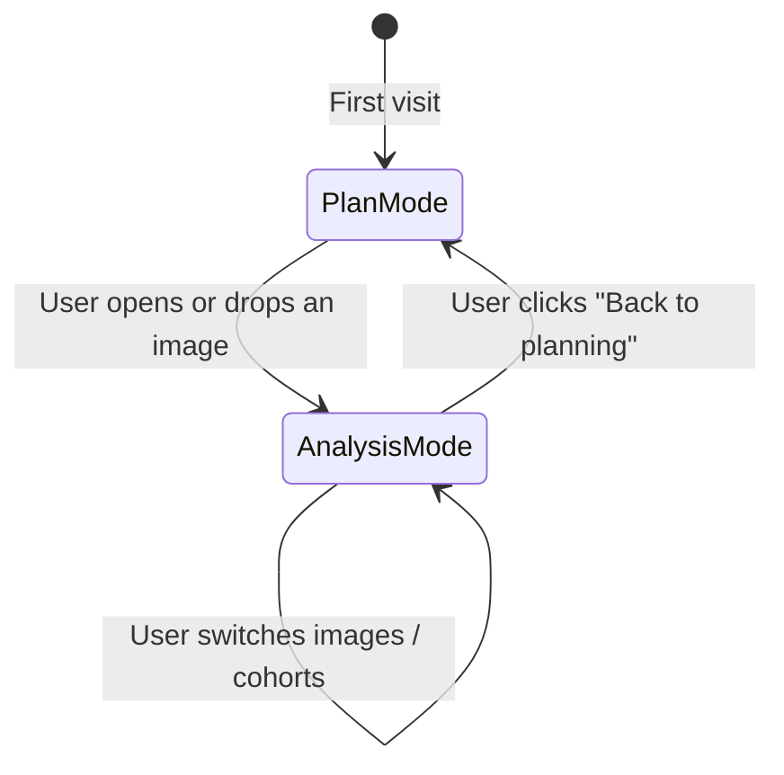
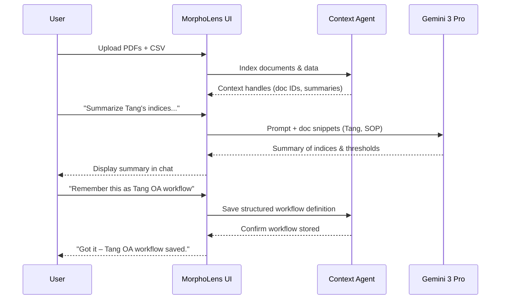
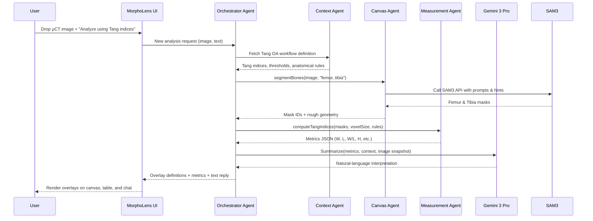
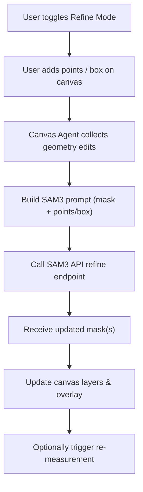
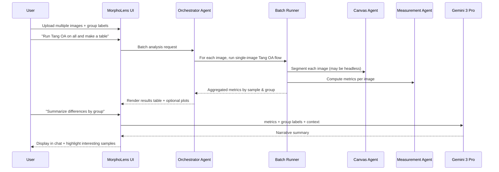
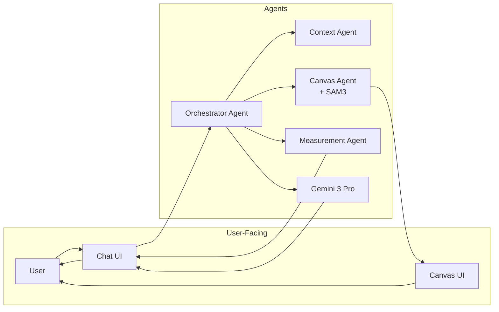

Here’s a focused **User Flow & UX** doc for MorphoLens, with the “WHY” baked into each flow and some mermaid diagrams to visualize things.

---

# MorphoLens – User Experience & Agent Flows

## 1. Big Picture: What the User Actually Feels

**Core promise to the researcher:**

> “Instead of hunting through menus and macros in ImageJ/Amira/QuPath, you talk to an assistant that knows your papers, your slides, and your metrics. It then *acts* on your images—segmenting, measuring, and explaining.”

Traditional tools like Fiji and QuPath expose powerful capabilities through toolbars, nested menus and scripting; users often struggle to discover what they need and compose steps into workflows.
MorphoLens instead treats **conversation as the main control surface** and uses agents to orchestrate segmentation and measurements behind the scenes.

At a high level, the UI has three surfaces:

1. **Context Panel** (left) – your papers, protocols, past CSVs (“Plan Mode”).
2. **Chat Panel** (center) – conversation + instructions with the “Research Copilot”.
3. **Canvas Panel** (right) – image viewer with overlays, measurements, and tables.

For **image work**, you mostly live in **Chat + Canvas**, with the Context Panel collapsed once the docs are loaded.

---

## 2. Global UX Concepts

### 2.1 Modes & Layout

We’ll keep the mental model simple:

* **Plan Mode** – Load and discuss documents, design analyses.
* **Analysis Mode** – Work on images (segmentation, measurements, comparisons).

Layout behavior:

* **Plan Mode**

  * Left: Context Panel (files, previews, summaries).
  * Center: Chat.
  * Right: Hidden or used for doc preview (optional).

* **Analysis Mode (for images)**

  * Left: Collapsed by default (context still available to the agent).
  * Center: Chat (slimmer).
  * Right: Canvas Panel (“image workspace”).

**Why this is better**

* **Fewer windows, more focus.** Fiji’s window soup and menu jungle are powerful but overwhelming for non-experts.
* **Mode-driven.** Users are either *planning* (text-heavy, doc-focused) or *analyzing images* (visual, canvas-focused), which matches how people actually work.

---

### 2.2 Canvas & Layer Model (for segmentation)

The Canvas has a simple mental model:

* **Base image** (μCT slice or projection).
* **Segmentation layers** (e.g., “Femur mask”, “Tibia mask”).
* **Annotation layers** (points, bounding boxes, lines).
* **Measurement overlays** (distance lines + labels, angle markers).

Each layer is:

* Named,
* Toggleable (eye icon),
* Owned by either:

  * The **Canvas agent** (automatic),
  * The **User** (manual edits).

This is what lets specialized agents operate safely on the canvas while keeping it understandable.

---

## 3. Flow A – Planning: Context Setup & Research Questions

### 3.1 User story

A bone biologist starts a new OA experiment and wants to encode their study context.

**Steps from the researcher’s perspective**

1. **Open MorphoLens → Plan Mode**

   * Sees:

     * Blank Chat in center.
     * “Drop your papers, protocols, and data here” zone on the left.

2. **Upload key context**

   * Drags:

     * Tang OA paper PDF.
     * Lab SOP PDF for μCT scanning.
     * CSV of previous MMS vs control experiment.

3. **Ask high-level question**

   * Types:

     * “These are the protocols we use and our last dataset. Summarize the key geometric indices Tang defines, and how they distinguish OA vs normal.”

4. **Get a research-aware summary**

   * Chat responds with:

     * A bullet list of indices (distal femoral W/L; tibial IIOC H/W).
     * The thresholds used in the paper.
     * A short explanation in plain language.

5. **Refine plan**

   * User: “Okay, I want to reuse those indices to analyze our GM-/- cohort and compare with WT. Remember this as our Tang OA workflow.”

Now the user has turned a PDF into a living **plan** the agent understands.

### 3.2 Agent flow (under the hood)

**Why this is better**

* Compared to scripting in Fiji/QuPath, the researcher doesn’t have to rewrite the paper as code; they just upload and *talk about it*.
* This matches human-in-the-loop paradigms where the human defines goals/context and the system formalizes and reuses them.

---

## 4. Flow B – Hero Flow: Single-Image Tang OA Analysis

This is the main demo flow.

### 4.1 User story

**Goal:** “Analyze OA severity of this mouse knee using Tang’s indices.”

**Steps from the researcher’s perspective**

1. **Enter Analysis Mode**

   * From Plan Mode, user either:

     * Clicks “Start analyzing images”, or
     * Drags a μCT knee slice PNG straight into Chat.

2. **Image focused view**

   * Layout switches:

     * Context Panel collapses.
     * Chat narrows to the left.
     * Canvas opens on the right showing the new image.

3. **Give a high-level instruction**

   * User types:

     > “Using Tang’s μCT OA indices we set up earlier, analyze this knee for OA severity.”

4. **Watch the system work**

   * UI shows a short “Working…” indicator in chat:

     * “Segmenting femur and tibia…”
     * “Measuring geometric indices…”

5. **See visual + numeric result**

   * Canvas:

     * Original μCT slice.
     * Overlaid masks (Femur = blue, Tibia = green).
     * Four key lines:

       * Femur width, femur length.
       * Tibial width, tibial IIOC height.

   * Below image: Metrics table:

     | Metric                   | Value | Tang normal band |
     | ------------------------ | ----- | ---------------- |
     | Femur width / length     | 1.33  | < 1.28           |
     | Tibial IIOC height/width | 0.25  | > 0.28           |

   * Chat:

     * A short explanation referencing Tang:

       * “Femur W/L = 1.33, which is above the 1.30 OA cutoff described in Tang et al.”
       * “Tibial IIOC H/W = 0.25, below the 0.28–0.30 typical of normal joints.”
       * “Taken together, this looks like a severe OA-like morphology.”

6. **Refine if needed**

   * User notices one endpoint looks slightly off.
   * Drags the femur-width line a few pixels.
   * Metrics table updates.
   * User types: “Re-evaluate using the updated measurements.”
   * Chat updates interpretation.

### 4.2 Agent flow (under the hood)

**Why this is better**

* For the user, the steps collapse to: “Upload image → describe desired analysis.”
  No more hunting in menus or rewriting the paper’s geometry math.
* For judges, it clearly shows **agentic behavior**: the orchestrator agent chooses tools (segmentation, measurement, LLM) and wires them together automatically.

---

## 5. Flow C – Interactive Segmentation & Manual Refinement

This is where “point prompts” and bounding boxes come in.

### 5.1 User story

**Goal:** “Help the model get better segmentation, especially around osteophytes.”

Steps:

1. **Initial auto-segmentation**

   * After the first run, user sees:

     * Good femur/tibia segmentation,
     * But maybe osteophyte region is under-segmented.

2. **User asks for refinement**

   * “The tibial segmentation is missing this osteophyte. Let’s refine it.”
   * User clicks “Refine segmentation” mode in the canvas.

3. **Canvas refinement tools appear**

   * User can:

     * Click *positive point* inside missing region.
     * Draw a bounding box around problem region.
     * Or mark *negative points* where segmentation bled into soft tissue.

4. **Agent updates SAM prompts**

   * Canvas Agent:

     * Sends existing mask + new positive/negative points or box back to SAM3.
     * Receives updated mask.
     * Updates the overlay in real time.

5. **Re-run measurements**

   * User clicks “Recompute indices” or types: “Re-run Tang OA metrics with updated tibial mask.”
   * Measurement Agent recomputes distances/ratios.
   * Chat updates interpretation.

### 5.2 Canvas agent flow

**Why this is better**

* Mirrors **human-in-the-loop segmentation** workflows where users guide a model rather than doing everything manually.
* Unlike static ImageJ macros, the interaction is *live* and *visual*: click, see model react, recompute measurements.

---

## 6. Flow D – Cohort Comparison & Narrative

Once single-image analysis works, the user will want cohort-level insight.

### 6.1 User story

**Goal:** “Compare WT vs GM-/- knees across several images.”

Steps:

1. **Queue multiple samples**

   * User drags in a folder, or multiple images:

     * Labels them in a simple dialog: “WT 8w MMS”, “GM-/- 8w MMS”, “WT Control”, etc.

2. **Ask for batch analysis**

   * “Run the Tang OA workflow on all of these and build a table by group.”

3. **See the table + plots**

   * A table appears in the Canvas region (or tabbed panel):

     | Sample ID  | Group     | Femur W/L | Tibial H/W | OA-like? |
     | ---------- | --------- | --------- | ---------- | -------- |
     | WT_8w_01   | WT 8w MMS | 1.34      | 0.24       | Yes      |
     | GMKO_8w_01 | GM-/- 8w  | 1.28      | 0.29       | Border   |
     | WT_ctl_01  | Control   | 1.23      | 0.31       | No       |
     | …          | …         | …         | …          | …        |

   * Optional: quick swarm/box plot for each metric by group.

4. **Ask for interpretation**

   * “Summarize the differences between WT and GM-/- at 8 weeks using Tang indices.”
   * Chat responds:

     * “WT MMS shows consistently elevated femur W/L and reduced tibial H/W vs controls, while GM-/- has intermediate values closer to normal, consistent with partial protection.”

### 6.2 Agent flow

**Why this is better**

* Researchers don’t have to hand-script batch processing like in Fiji scripting tutorials; they describe the desired summary, and the agent coordinates the loop.
* This is a clear **agentic workflow**: an orchestrator takes initiative to loop, aggregate, and then ask the LLM to summarize cohort-level patterns.

---

## 7. Agent Roles & Flows (Conceptual)

### 7.1 Agents & responsibilities

1. **Orchestrator Agent (OA)**

   * Lives in the chat loop.
   * Responsibilities:

     * Parse user intent.
     * Decide which specialized agent(s) to call.
     * Manage session state (which image, which workflow).
     * Route results back into a coherent response.

2. **Context Agent (Ctx)**

   * Owns:

     * Document ingestion (PDFs, SOPs).
     * CSV parsing.
   * Provides:

     * Workflow definitions (e.g., “Tang OA” schema).
     * Snippets from docs when requested.

3. **Canvas Agent (Canvas)**

   * Owns:

     * The image layer model.
     * Segmentation via SAM3.
     * Point/box prompts and mask updates.
   * Provides:

     * Mask IDs and geometry to other agents.

4. **Measurement Agent (Meas)**

   * Owns:

     * Measurement code (distances, ratios).
   * Provides:

     * Structured numeric results for any given workflow.

5. **LLM (Gemini 3 Pro)**

   * Owns:

     * Multimodal reasoning.
   * Provides:

     * Natural language explanations,
     * Scientific interpretations,
     * Summaries and comparative narratives.

### 7.2 High-level orchestration pattern

Conceptually, MorphoLens uses a **handoff pattern** where the Orchestrator Agent coordinates specialized agents and tools.

**Why this is better**

* Keeps the UX **simple** (“I talk to one assistant”) while the system internally coordinates multiple tools and models.
* Aligns with emerging patterns in multi-agent orchestration and HITL design where human users interact with a single surface, but specialized agents do the work.

---

## 8. Quick Recap in UX Terms

* **Plan Mode**: Upload and discuss papers + SOPs + prior CSVs.
  → Agent extracts and formalizes measurement workflows (e.g., Tang OA).

* **Analysis Mode – Single Image**:
  Upload an image → ask for Tang OA analysis → see segmentation, measurements, and explanation → tweak & rerun.

* **Analysis Mode – Interactive Segmentation**:
  Use point prompts and bounding boxes on the canvas to guide SAM3; recompute metrics as needed.

* **Analysis Mode – Cohort Comparison**:
  Upload multiple images with group labels → ask for batch Tang OA analysis → get a table and narrative summary.

* **Agent Flows**:
  One chat “brain” orchestrates context, segmentation, measurement, and interpretation agents for you.

If you want, next we can zoom in on **microcopy & screen states** (what exact text appears on buttons, the minimal set of modes in the Canvas, etc.), or design a **scripted demo run** where we list every click and line of dialogue for the hackathon video.
